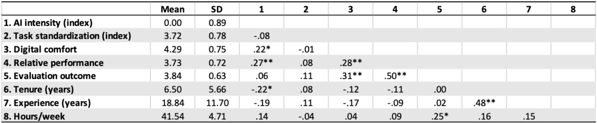
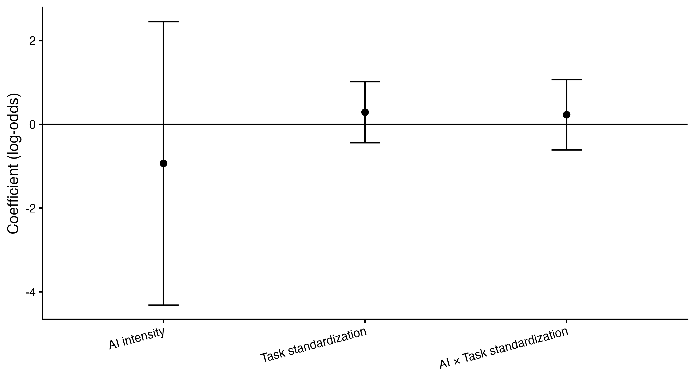

# Abstract

Recent advances in artificial intelligence have generated widespread expectations of productivity gains among knowledge workers. However, empirical evidence remains mixed, and little is known about the conditions under which AI contributes to performance. Drawing on a survey of knowledge workers, this study examines whether the relationship between AI use and performance depends on task structure and worker capability. Results from ordinal logistic regression models indicate that AI use is not uniformly associated with higher formal evaluation outcomes. Instead, performance differences are more strongly associated with worker digital comfort and its interaction with AI use. These findings suggest that AI functions as a complementary asset rather than a standalone productivity enhancer, with implications for both theory and organizational practice.

# Introduction

Artificial intelligence (AI) is increasingly integrated into knowledge work, with organizations investing heavily in tools intended to enhance productivity. Prior research suggests that AI can improve performance in certain contexts, particularly in structured tasks or when workers effectively integrate AI outputs into their workflows (Brynjolfsson, Li, & Raymond, 2023; Noy & Zhang, 2023). However, emerging evidence also points to substantial heterogeneity in outcomes, raising questions about when and for whom AI is beneficial.

This study examines whether the productivity effects of AI depend on task structure and worker capability. Building on a complementary assets perspective (Puranam, 2021), I argue that AI is unlikely to generate uniform productivity gains. Instead, its effectiveness depends on alignment with both the nature of the task and the capabilities of the worker.

# Theory and Hypotheses

## AI as a Complementary Asset

Rather than functioning as an independent driver of productivity, AI may operate as a complementary asset whose value depends on its integration with human skills and task environments. Prior research in economics and organizational theory suggests that technologies often generate value only when combined with complementary human and organizational investments (Brynjolfsson et al., 2023; Puranam, 2021).

## Task Structure

Tasks vary in the extent to which they are structured, with more structured tasks characterized by clearer objectives and evaluation criteria. AI may be particularly effective in such environments, where outputs can be more easily validated and integrated.

## Worker Capability

Worker capability, operationalized here as digital comfort, reflects an individual’s ability to effectively use and evaluate AI outputs. Recent work suggests that performance gains from AI are concentrated among workers who are better able to incorporate AI into their workflows (Noy & Zhang, 2023).

## Hypotheses

- H1: AI use is positively associated with performance.  
- H2: The relationship between AI use and performance is stronger for more structured tasks.  

# Methods

## Sample

Data were collected through an online survey of knowledge workers. After applying basic quality filters, the final sample consisted of 102 respondents, with 69 providing formal evaluation outcomes.

## Measures

### AI Intensity Index

AI intensity was constructed as the average of standardized measures of AI usage frequency, proportion of work involving AI, and degree of AI integration into workflows. Internal consistency was acceptable (Cronbach’s $\alpha \approx 0.78$).

### Task Standardization Index

Task standardization was constructed from task clarity, clarity of performance criteria, clarity of solution paths, and reverse-coded task judgment. Internal consistency was acceptable (Cronbach’s $\alpha \approx 0.81$).

### Digital Comfort

Digital comfort was measured using a self-reported scale capturing confidence in using digital tools.

### Outcomes

Two performance measures were used:
- Formal evaluation outcome (ordinal)
- Relative performance (self-reported)

## Descriptive Statistics

{#tbl-descriptives}

# Results

## Primary Analyses

AI intensity was not significantly associated with formal evaluation outcomes, providing limited support for H1. Task standardization also did not exhibit a significant main effect.

## Exploratory Moderation by Worker Capability

To further examine heterogeneity in AI-related performance, additional models incorporated digital comfort as a moderator. Because the lowest category of the evaluation outcome was sparse, it was collapsed into the adjacent category for estimation stability.

![Exploratory ordinal logistic regression models. Entries are log-odds coefficients with 95% confidence intervals in brackets. Model 1 includes AI intensity, task standardization, and their interaction. Model 2 adds digital comfort and the AI intensity × digital comfort interaction. Model 3 includes the full three-way interaction among AI intensity, task standardization, and digital comfort. Continuous predictors are mean-centered. The formal evaluation outcome collapses the sparse lowest category into the adjacent category for estimation stability. *p* < .05, **p** < .01, ***p*** < .001.](../output/tables/tab_exploratory_models.png){#tbl-exploratory}

Digital comfort was strongly associated with performance, and the interaction between AI intensity and digital comfort was positive and significant. This suggests that AI contributes to performance primarily among workers with higher capability.

Interestingly, the interaction between task standardization and digital comfort was negative, indicating that worker capability may substitute for structured task environments.

## Marginal Effects

## Configurational Effects

The three-way interaction was not statistically significant, suggesting limited evidence for fully configurational effects.

# Discussion

The results suggest that AI is not a universal productivity enhancer. Instead, its effects depend critically on worker capability and, to a lesser extent, task structure. These findings align with a complementary asset perspective, in which technology generates value only when combined with appropriate human and organizational factors (Brynjolfsson et al., 2023; Puranam, 2021).

The strong role of digital comfort highlights the importance of capability development in realizing AI’s potential. Organizations investing in AI may therefore benefit from parallel investments in training and skill development.

## Limitations

This study is based on cross-sectional survey data and relies on self-reported measures for some variables. Future research should examine these relationships using longitudinal or experimental designs.

## Conclusion

AI’s impact on productivity is contingent rather than universal. Understanding the conditions under which AI enhances performance is essential for both theory and practice.